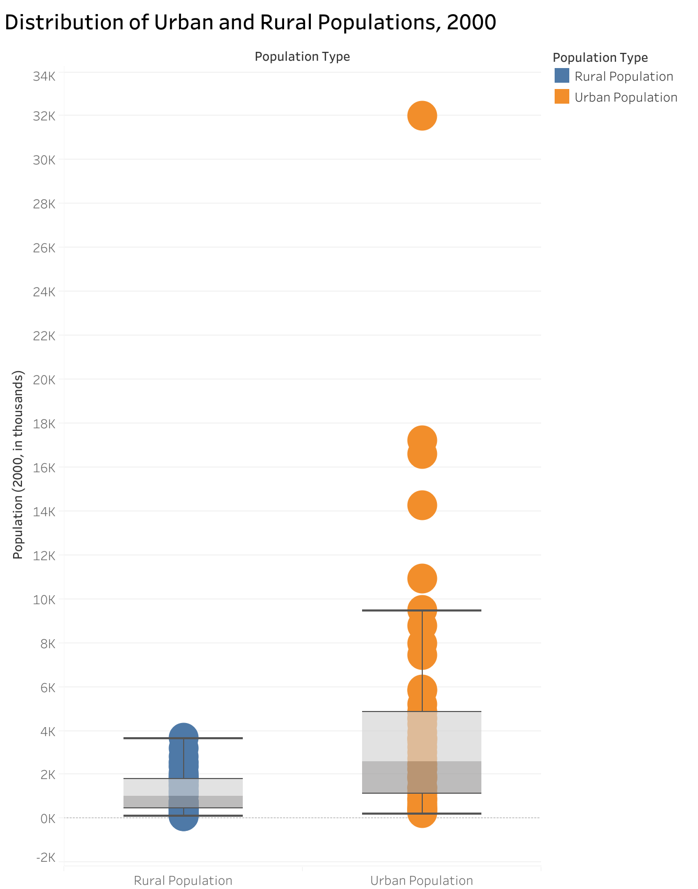
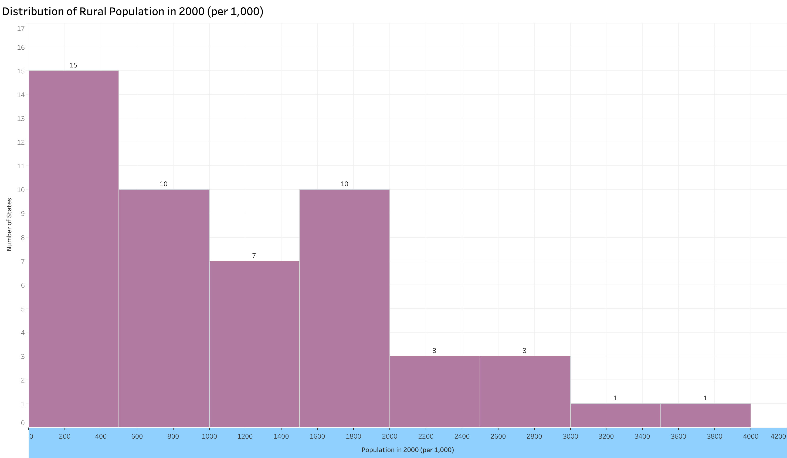
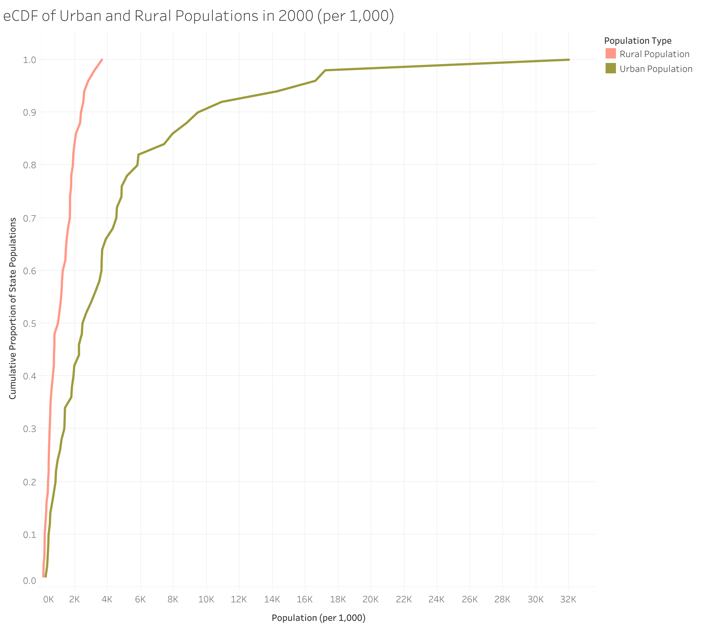
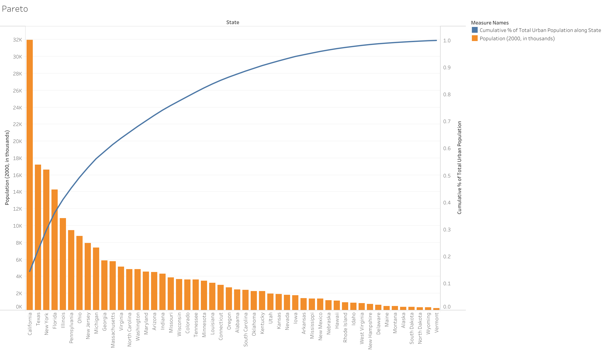
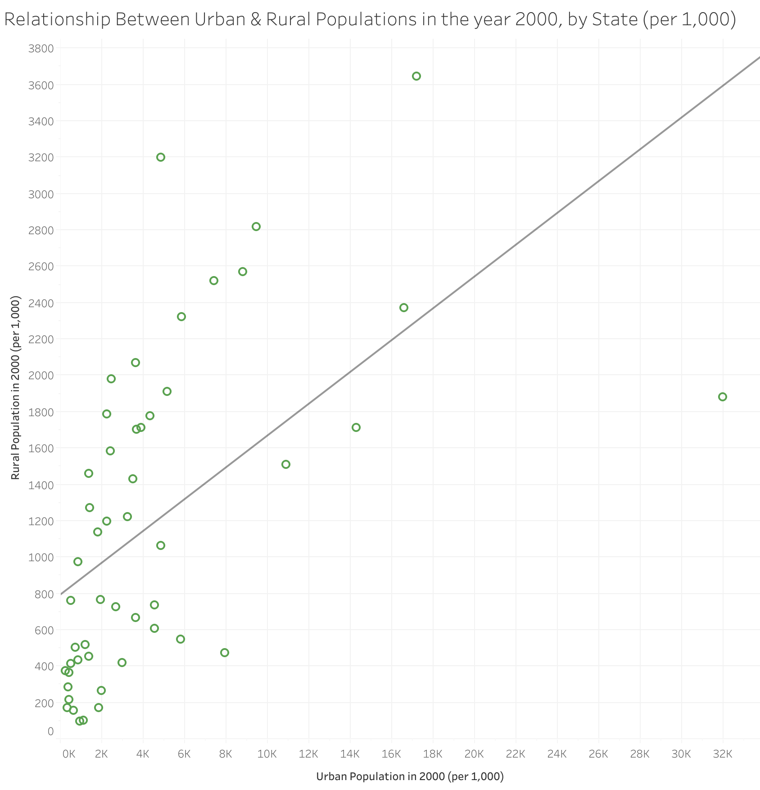

# Homework 5: Analyzing Data Using Distribution Charts

Tara Seabolt  
CS 625, Fall 2025  
Due: November 2, 2025

## Dataset: ([Section 1. Population]([https://www.census.gov/library/publications/2010/compendia/statab/130ed/population.html])) / Table 29 - Urban and Rural Population by State

## Part 1: Create Distribution Charts

### Data Manipulation

Prior to creating my charts, I made changes to the data provided by narrowing down the selected data to only what was needed and re-formatting the data using Tableau, where I pivoted the data to a long format for better handling in the visualization creation process. I selected only the 50 states from the original dataset, eliminating the overall United States totals and the District of Columbia. Then I narrowed down the data to just the overall urban and rural populations for the year 2000.

Link to Excel workbook with added sheet and table: ([Table 29: Urban and Rural Population by State]([https://github.com/odu-cs625-datavis/fall25-mcw-taseabolt/blob/main/Table%202.xls](https://github.com/odu-cs625-datavis/fall25-mcw-taseabolt/blob/main/Table%2029.xlsx))

Link to Tableau workbook: ([HW5 - Urban & Rural Population Distributions](https://github.com/odu-cs625-datavis/fall25-mcw-taseabolt/blob/main/HW5.twb))

### Box Plot Chart: Distribution of Urban and Rural Populations in the year 2000 (per 1,000)

describe each of your charts and how they were created (explain the code you used and include code snippets)
discuss the advantages and disadvantages of each type of distribution chart idiom for showing these distributions (talk specifically about these distributions, not just their advantages and disadvantages in general)
name 1-2 simple observations you can draw from each chart

For this chart, I created a box plot in Tableau with the box-and-whisker option. I placed the population type (urban vs rural) on the x-axis and placed the population totals for each state on the y-axis. Utilizing the box plot idiom for this distrubition provided an easy visualization of the central tendency (the median) and shows the spread with the use of the box and whiskers (which shows the full range of the spread) for both the urban and rural populations. This allows for an effective side-by-side comparison to show how each population type is distributed and the similarities / differences between the two. However, a disadvantage of utilizing the box plot idiom for this dateaset is that there are multiple outliers, specifically for the urban population plot. 

### Histogram Chart: Distribution of Rural Population in the year 2000 (per 1,000)

For this chart, I created a histogram plot in Tableau with the bar option. I placed the population totals on the x-axis and created a count of the states for the y-axis. This distribution chart idiom shows the overall distribution of states in regards to their rural populations. Utilizing the histogram idiom for this distrubition shows the shape and spread of how manys states fall within the particular population ranges. However, a disadvantage of this histogram chart is that one had to be mindful of the bin size because not utilizing a proper bin size could change the interpretation of the data. Therefore, I had to be mindful of which bin size to choose when creating the chart, to ensure that the data was presented correctly and proper interpretations could be made. 

### eCDF Chart: Rural and Urban Population Distribution in the year 2000 (per 1,000)

For this chart, I created a eCDF plot in Tableau with the line option. I placed the population totals on the x-axis and created a calculated field for the eCDF on the x-axis utilizing the formula INDEX() / SIZE() which takes the rank of each state in the sort order divided by the total count of states for the y-axis. This distribution chart idiom shows the overall comparision between the urban and rural population distributions. Utilizing the eCDF idiom is adventageous in that it allows for outliers and is less affected by them like in a box plot or histogram. In addition, a eCDF doesn't require certain attributes, like binning size choice and allows for direct comparision on the same visualization. However, a disadvantage of this eCDF chart is that the smaller distributions within the rural populations can make it more difficult to have uniform comparisons between it and the more robust urban populations which create a smoother curve. 

## Part 2: Further Analysis

****Interesting Finding 1****

One interesting finding about the data is that the urban population distribution is highly skewed to the right, with only a few states accounting for a decent share of the urban population. I came to this finding by looking at and interpreting the box plot visualization that was created, which showed that the urban distribution has a much larger upper whisker, indicating a larger spread. The box plot idiom also showed several high outliers (California, Texas, New York, Florida) outside of the box and whiskers, which indicates that these staes have a higher urban population density than other states. In addition, the eCDF line for the urban population climbs slowly at first, then steeply at the end, showing that only a few states hold a large fraction of the total urban population. I created a Pareto bar chart which shows the cumulative share of urban populations by state. The result showed that approximately ten states (including California, Texas, New York, Florida, Illinois, Pennsylvania, Ohio, New Jersey, Michigan, and Georgia) accounted for over 60% of the total urban population in the year 2000.

****Interesting Finding 2****

Another interesting finding about the data is that states with higher urban populations tend to have lower rural populations, suggesting an inverse relationship between the two. This is indicated in the box plot idiom where the urban population had a much wider spread and higher median value, but the rural population was more compact, with tighter clusters & lower values. In addition, the eCDF line for the rural population rises much faster than the line for the urban population which shows that many states have small rural populations that accumulate quickly and that a handful of certain states, like North Carolina and Texas, also have small rural populations in addition to larger urban ones. I created a scatterplot chart which shows the relationship between the urban & rural populations in the year 2000, by state. It shows that states with higher urban populations tend to have lower rural populations and that states with higher rural populations tend to have lower urban populations.

## References
* Markdown Guide: Basic Syntax, <https://markdownguide.offshoot.io/basic-syntax/>
* Basic Writing & Formatting Syntax, <https://docs.github.com/en/get-started/writing-on-github/getting-started-with-writing-and-formatting-on-github/basic-writing-and-formatting-syntax>
* Section 1, Population: Table 29 - Urban and Rural Population by State, https://www.census.gov/library/publications/2010/compendia/statab/130ed/population.html
* Chart Redesigns, <https://github.com/odu-cs625-datavis/public-fall25-mcw/blob/main/Chart-Redesigns.md>
* Build Charts & Analyze Data, <https://help.tableau.com/current/pro/desktop/en-us/design_and_analyze.htm>
* Build a Box Plot, <https://help.tableau.com/current/pro/desktop/en-us/buildexamples_boxplot.htm>
* Unpivot Tables, <https://learn.microsoft.com/en-us/power-query/unpivot-column>
* Emperical Culmulative Distribution Function (CDF) Plots, <https://statisticsbyjim.com/graphs/empirical-cumulative-distribution-function-cdf-plots/#google_vignette>
