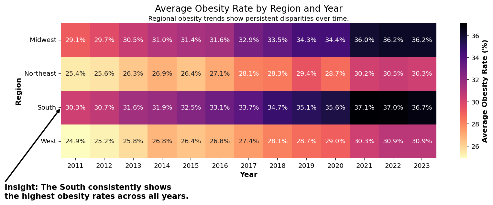

# Final Project - Heatmap Chart Regarding Obesity Rates Within the United States

Tara Seabolt  
CS 625, Fall 2025  
Due: December 7, 2025

### Original Dataset: ([HHS CDC Nutrition, Physical Activity, and Obesity - Behavioral Risk Factor Surveillance System](https://catalog.data.gov/dataset/nutrition-physical-activity-and-obesity-behavioral-risk-factor-surveillance-system))

## Data selection and cleaning

For my project, I decided to select a publically published dataset from the Centers for Disease Control called "Nutrition, Physical Activity, and Obesity - Behavioral Risk Factor Surveillance System" which includes collected data from the Behaviroal Risk Factor Surveillance System (BRFSS) on the diet, physical activity, and weight status of adults within the United States. The BRFSS is a telephone survey program that collects state-specific data on people’s health behaviors, long-term conditions, and preventive healthcare practices. After downloading the original dataset from ([Data.gov](https://www.data.gov)), I then cleaned and made changes to the data prior to review. First, I removed all data for the District of Columbia and U.S. Territories (including Guam, Puerto Rico, and the Virgin Islands), narrowing my focus to only the 50 states. Then, I made the decision that having data for all 50 states over the span of 12 years might be too busy for my visualization, so I decided to shift my focus from all 50 states to just the 4 regions of the United States. Doing this would still allow me to narrow down my focus and also still see trends and disparities over time. For my data, I created an xlookup formula to map each state to it's correponding ([assigned region from the Census Bureau](https://www2.census.gov/geo/pdfs/maps-data/maps/reference/us_regdiv.pdf)). My next step involved narrowing down my focus to only include data for the question about "Percent of adults aged 18 years and older who have obesity" which provided the average obesity percentage rate for every state each year. Then I created a pivot table with just hte 4 regions and the total average obesity percentage rate for that particular region from the years 2011 to 2023. This is the final data that I used for my visualization idiom. 

## Final Question Addressed

When reviewing, cleaning, and analyzing my data, I really deicded to take a close look at the average percentages of adults with obesity in the United States. This led me to ask the question: "How have adult obesity rates changed from 2011 to 2023 across the four U.S. Regions (Northeast, South, Midwest, and West)?" When looking at the data with this specific question in mind, I realized that my cleaned data showed all U.S. Regions having increases in adult obesity rates from 2011 to 2023, but also that the South has consistently had the highest adult obesity rates during each year of this time frame. In addition, the gap between the South and other regions also has widened during this time as well.

## Final Heatmap Chart of Average Obesity Rates by Region and Year, from 2011 to 2023

My final heatmap chart directly answered my question that I addressed by showing how obesity rates vary across U.S. regions over time, allowing for clear visual comparison across both geography and year. By encoding the average obesity rate as color intensity, darker shades immediately draw attention to regions with consistently higher rates. The South is visibly the darkest row across all years, demonstrating that this region remains the highest in obesity prevalence over time. The annotation and arrow reinforce this insight by explicitly pointing the viewer to this trend.

The headline I selected, “Regional obesity trends show persistent disparities from 2011 to 2023”, aligns with the visualization because it summarizes the main insight the chart reveals. The viewer can look at the heatmap and immediately connect the title to what the data shows: these gaps are not temporary, but continue across the entire time period.

- Link to Excel workbook with added sheets & Pivot Table: ([HHS CDC BRFSS - Cleaned Data](https://github.com/odu-cs625-datavis/fall25-mcw-taseabolt/blob/main/BRFSSData_FinalProject.xlsx))

- Link to Python code / file: ([Final Project - Python Plot](https://github.com/odu-cs625-datavis/fall25-mcw-taseabolt/blob/main/FinalProjectPlot.py))

## Final Thoughts

The development of this project went from simply locating an interesting dataset to focusing in on a specific question within that dataset to creating a full-on visualiation highlighting an interesting finding that was found when reviewing the data. The overall project took about 5 hours total, including the preparation of the data, sketching out chart examples, researching how to create a heatmap in python, and then finaly creating the plot utilizing python, pandas, matplotlib, and seaborn. I spent the majority of my time during this process adjusting formatting, experimenting with figure size, formatting labels, and positioning the annotated text and arrow so they were visually meaningful without distracting from the data. The most challenging part was managing the many small design choices, such as spacing, annotation placement, and color emphasis, because they had a noticeable impact on readability and user understanding. Once those details were resolved, the chart finally shifted from simply displaying numbers to actually conveying a story about U.S. regional obesity rate differences over time.

## References
* Markdown Guide: Basic Syntax, <https://markdownguide.offshoot.io/basic-syntax/>
* Basic Writing & Formatting Syntax, <https://docs.github.com/en/get-started/writing-on-github/getting-started-with-writing-and-formatting-on-github/basic-writing-and-formatting-syntax>
* HHS CDC - Nutrition, Physical Activity, and Obesity - BRFSS, <https://catalog.data.gov/dataset/nutrition-physical-activity-and-obesity-behavioral-risk-factor-surveillance-system>
* CDC BRFSS, <https://www.cdc.gov/brfss/index.html>
* Census Regions & Divisions of the United States, <https://www2.census.gov/geo/pdfs/maps-data/maps/reference/us_regdiv.pdf>
* Chart Redesigns, <https://github.com/odu-cs625-datavis/public-fall25-mcw/blob/main/Chart-Redesigns.md>
* Five Charts You've Never Used but Should, <https://policyviz.com/2021/02/08/five-charts-youve-never-used-but-should/>
* Heatmaps in Python, <https://plotly.com/python/heatmaps/>
* Seaborn Heatmap, <https://seaborn.pydata.org/generated/seaborn.heatmap.html>
* Seaborn Heatmap - A Comprehensive Guide, <https://www.geeksforgeeks.org/python/seaborn-heatmap-a-comprehensive-guide/>
* Annotated Heatmap, <https://matplotlib.org/stable/gallery/images_contours_and_fields/image_annotated_heatmap.html>
* Annotate Plots, <https://matplotlib.org/stable/gallery/text_labels_and_annotations/annotation_demo.html>

